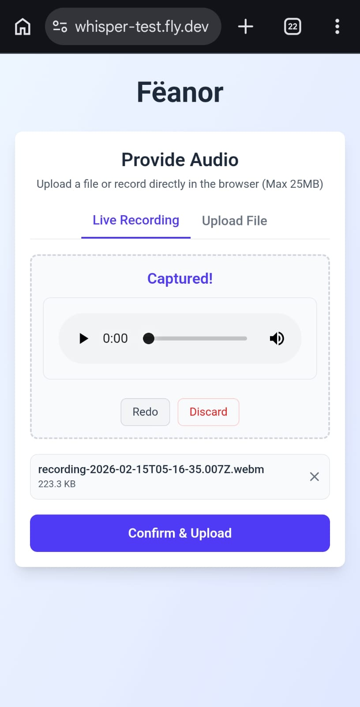
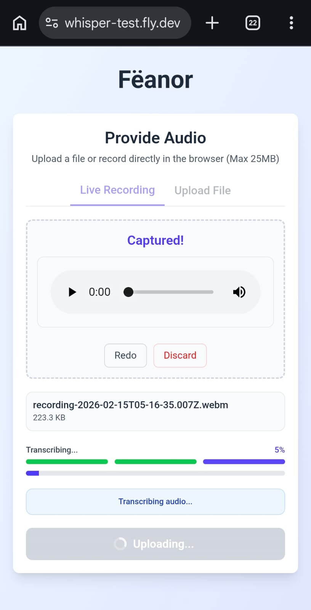
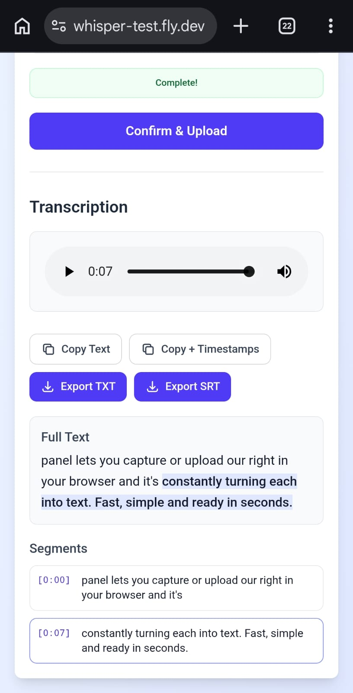

# 🎙️ Fëanor

[](https://nextjs.org/)
[](https://www.typescriptlang.org/)
[](https://tailwindcss.com/)
[](https://www.docker.com/)
[](https://opensource.org/licenses/ISC)

> A powerful and privacy-focused audio transcription web application. Record, upload, or drag-and-drop audio files to get accurate transcriptions with interactive playback and flexible export options — all powered by local AI processing.

---

## ✨ Features

### Input Methods
- **File Picker**: Click to select audio files from your device
- **Drag & Drop**: Simply drag audio files onto the interface for instant upload
- **Live Recording**: Browser-based microphone recording with real-time waveform visualization
  - Visual feedback during recording with animated waveform display
  - Preview recordings before transcription
  - Built-in playback controls with Redo/Discard options

### Processing
- **Automatic Audio Conversion**: Converts any audio format to WAV 16kHz mono via FFmpeg
- **Local AI Transcription**: Powered by [whisper.cpp](https://github.com/ggerganov/whisper.cpp) — no external APIs required
- **Real-time Progress Feedback**: Multi-phase progress bar showing upload → conversion → transcription status
- **Privacy First**: Automatic cleanup of all uploaded and temporary files after processing

### Output Options
- **Interactive Transcription Display**: Audio player synchronized with transcription segments
- **Bidirectional Synchronization**:
  - Click any segment to jump to that timestamp in audio
  - Playback automatically highlights the current speaking segment
- **Copy to Clipboard**:
  - Plain text (full transcription)
  - With timestamps (formatted with segment times)
- **Export Formats**:
  - TXT file (plain text transcription)
  - SRT file (subtitle format with timestamps)

### User Experience
- **Enhanced Typography**: Improved readability with refined font hierarchy
- **Mobile Responsive**: Optimized interface for all screen sizes
- **Visual Polish**: Clean, modern design built with Tailwind CSS 4
- **Fast & Lightweight**: Uses the "tiny/base" Whisper model for rapid results

---

## 📸 Screenshots

### Live Recording Interface

*Browser-based recording with real-time waveform visualization, playback controls, and Redo/Discard actions*

### Transcription Processing

*Multi-phase progress bar showing current transcription status (upload → conversion → transcription)*

### Transcription Results

*Interactive results with audio player, export options, clickable segments, and full timestamped transcript*

---

## 🚀 Quick Start (Docker)

The fastest way to get started is using Docker. This ensures all dependencies like FFmpeg and the Whisper binary are correctly configured.

### 1. Build the image
```bash
docker build -t whisper-test .
```

### 2. Run the container
```bash
docker run --rm -p 3000:3000 whisper-test
```

Open [http://localhost:3000](http://localhost:3000) in your browser.

---

## 🛠️ Local Development

If you prefer to run it without Docker, you'll need to set up the environment manually.

### Prerequisites
- **Node.js 22+** (or latest LTS)
- **FFmpeg** installed and available in your PATH
- **whisper.cpp** compiled binary (`whisper-cli`)

### Setup Steps

1. **Clone the repository:**
   ```bash
   git clone https://github.com/uiratan/whisper-test.git
   cd whisper-test
   ```

2. **Install dependencies:**
   ```bash
   npm install
   ```

3. **Configure environment variables:**

   Create a `.env.local` file in the project root:
   ```env
   WHISPER_CPP_PATH="/path/to/your/whisper-cli"
   WHISPER_MODEL_PATH="/path/to/your/ggml-base.bin"
   ```

   **Notes:**
   - The `WHISPER_CPP_PATH` should point to your compiled `whisper-cli` binary
   - The `WHISPER_MODEL_PATH` should point to your Whisper model file (e.g., `ggml-base.bin`)
   - Both paths must be absolute paths

4. **Run the development server:**
   ```bash
   npm run dev
   ```

5. **Open your browser:**

   Navigate to [http://localhost:3000](http://localhost:3000)

---

## 🚢 Deployment

### GitHub Actions CI/CD Pipeline

This project includes an automated deployment pipeline to Fly.io using GitHub Actions. Deployments are triggered by pushing git tags.

**Workflow file:** `.github/workflows/deploy.yml`

### Deployment Process

1. **Create and push a version tag:**
   ```bash
   git tag v2.1.0
   git push origin v2.1.0
   ```

2. **Automated steps** (handled by GitHub Actions):
   - Checkout code
   - Setup flyctl CLI
   - Deploy to Fly.io using `--remote-only` flag (builds Docker image on Fly.io remote builders)
   - Wait 30 seconds for deployment stabilization
   - Verify deployment status via `flyctl status`
   - Run HTTP health check against live app URL

### Prerequisites for Deployment

Before the automated deployment can work, you need to:

1. **Create a Fly.io app:**
   ```bash
   flyctl launch
   # or
   flyctl apps create whisper-test
   ```

2. **Configure GitHub repository secret:**
   - Generate Fly.io API token: `flyctl auth token`
   - Add `FLY_API_TOKEN` secret in your GitHub repository settings
   - Navigate to: Settings → Secrets and variables → Actions → New repository secret

### Monitoring

- **GitHub Actions**: https://github.com/[username]/whisper-test/actions
- **Fly.io Dashboard**: https://fly.io/apps/whisper-test
- **Live Application**: https://whisper-test.fly.dev/

---

## 🏗️ Architecture

### Technology Stack

- **Frontend**: Next.js 16 (App Router) with React 19
- **Styling**: Tailwind CSS 4 with enhanced typography
- **TypeScript**: Version 5.9+ for type safety
- **Audio Processing**: fluent-ffmpeg for format conversion
- **File Uploads**: react-dropzone for drag-and-drop interface
- **AI Transcription**: whisper.cpp (external binary)

### Processing Pipeline

1. **Input**: Receive audio file via file picker, drag-and-drop, or browser recording
2. **Upload**: Stream file to Next.js API route handler
3. **Conversion**: Convert to **WAV 16kHz Mono** (PCM s16le) using FFmpeg
4. **Transcription**: Execute `whisper-cli` with the converted file
5. **Parse**: Extract JSON output with text and timestamped segments
6. **Response**: Return transcription data to client
7. **Cleanup**: Automatically delete all temporary files via `finally` blocks

### API Routes

- **POST /api/upload**: Handles file uploads and initiates transcription pipeline
- **Streaming Response**: Real-time progress updates during multi-phase processing

---

## 🔒 Privacy & Security

- **Local Processing**: All transcription happens on your server — no data sent to external APIs
- **Automatic Cleanup**: All uploaded and temporary files are deleted immediately after processing
- **No Data Persistence**: Audio files and transcriptions are never stored on the server
- **Client-Side Audio**: Browser recording uses native Web Audio API — no audio leaves your device until you initiate transcription

---

## 📦 Tech Stack Details

| Component | Technology | Version |
|-----------|-----------|---------|
| Framework | Next.js | 16.1.6 |
| UI Library | React | 19.2.4 |
| Language | TypeScript | 5.9.3 |
| Styling | Tailwind CSS | 4.1.18 |
| Audio Processing | fluent-ffmpeg | 2.1.3 |
| File Uploads | react-dropzone | 15.0.0 |
| AI Model | whisper.cpp | external binary |

---

## 🐳 Docker Deployment

This project is optimized for containerized deployment on platforms like **Fly.io** or **Railway** using the provided `Dockerfile`.

**Memory Requirements**: The Whisper "base" model requires approximately 512MB-1GB of RAM for smooth execution. Ensure your deployment target has sufficient resources.

---

## 📄 License

This project is licensed under the ISC License.

---

Built with ❤️ by [Uiratan Cavalcante](https://github.com/uiratan)
